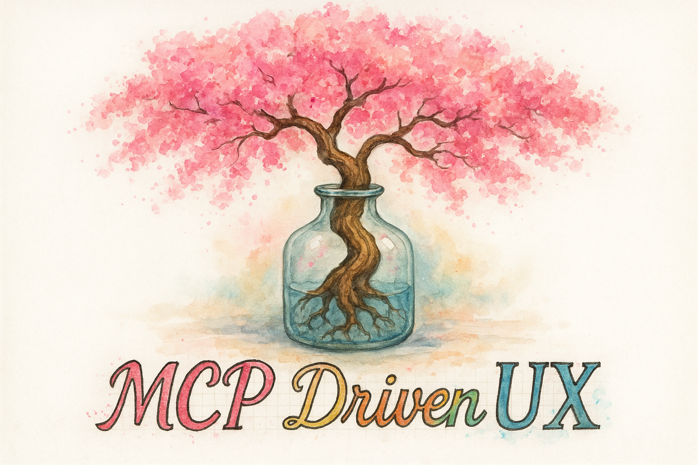
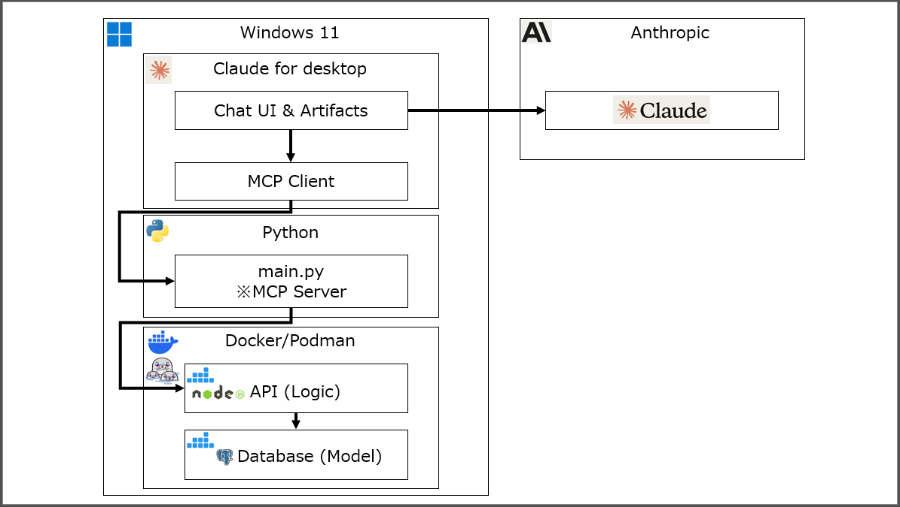

# MCP Driven UX Template

<div align="center">

<p align="center">
  
</p>


<p align="center">
  <a href="./README.md"></a>
  <a href="./README_JA.md"></a>
  <a href="./README_CN.md"></a>
  <a href="./README_TW.md"></a>
  <a href="./README_KR.md"></a>
  <a href="./README_AR.md"></a>
</p>

**Next-generation user experience "MCP Driven UX" ticket management system template**

<a href="https://www.youtube.com/watch?v=Q7iKhyOF_OM" target="_blank" rel="noopener noreferrer">
  
</a>

*YouTube: Introduction: MCP Driven UX Template*

</div>

## 📋 Overview

This project is a reference implementation of "MCP Driven UX" that proposes a paradigm shift from traditional MVC (Model-View-Controller) architecture to interactive interfaces with LLMs.

Leveraging the Model Context Protocol (MCP), this project demonstrates role division and implementation methods for the following technology stack using a ticket management system as a sample:

- **MCP Server (Python)**: Integration between LLM and backend API
- **Business Logic (TypeScript)**: RESTful API implementation
- **Data Model (PostgreSQL)**: Persistence layer management

## 🎯 Concept

### From MVC to MCP Driven UX

Current web services and client-server applications are mainly based on the MVC pattern. However, with the rise of LLMs and standardization like MCP, a transition from UI-based services to interactive (chat/voice) interfaces is expected.

This repository implements a ticket management system as an example template to realize this transition.

### Architecture



```
┌─────────────┐     MCP      ┌───────────────┐     HTTP     ┌──────────────┐
│   Claude    │◄────────────►│  MCP Server   │◄────────────►│  API Server  │
│  Desktop    │              │   (Python)    │              │ (TypeScript) │
└─────────────┘              └───────────────┘              └──────┬───────┘
                                                                   │
                                                                   ▼
                                                             ┌──────────────┐
                                                             │  PostgreSQL  │
                                                             │     (DB)     │
                                                             └──────────────┘
```

## ✨ Main Features

- **Ticket Management**
  - Create, update, search, and view ticket details
  - History management and comment functionality
  - Status management and assignee allocation

- **MCP Integration**
  - Natural language ticket operations from Claude Desktop
  - Master data reference and filtering
  - Real-time status confirmation

- **Enterprise Features**
  - Role-based access control
  - Audit trail and log management
  - Multi-tenant support

## 🛠️ Tech Stack

### Backend
- **MCP Server**: Python 3.9+, MCP SDK
- **API Server**: Node.js, TypeScript, Express, PgTyped
- **Database**: PostgreSQL 16

### Infrastructure
- **Container**: Docker/Podman
- **Orchestration**: Docker Compose

## 📥 Installation

### Prerequisites

- Docker or Podman (recommended)
- docker-compose or podman-compose
- Python 3.9+ (for MCP server)
- Node.js 18+ (for API server)
- Claude Desktop (MCP client)

### Setup Steps

1. **Clone the repository**

```bash
git clone https://github.com/Masa1984a/MCP_Driven_UX_Template.git
cd MCP_Driven_UX_Template
```

2. **Authentication setup** (Podman/Docker)

```bash
# For Podman
podman login docker.io --username <username>

# For Docker (also required when using compose with Podman)
docker login docker.io --username <username>
```

3. **Environment variable setup**

```bash
cp .env.sample .env
# Edit .env file as needed (change INIT_LANG=ja for Japanese data)
```

4. **Start containers**

```bash
# For Podman
podman compose up -d

# For Docker
docker-compose up -d
```

5. **Python virtual environment setup**

Set up the Python environment for the MCP server:

```bash
cd ./mcp_server
python -m venv .venv
.venv\Scripts\Activate.ps1  # For Windows PowerShell
# For Bash/Linux/Mac: source .venv/bin/activate
python -m pip install --upgrade pip
pip install -r requirements.txt
```

6. **API Key configuration (for local MCP server)**

When running MCP server locally, you need to set the API key:

```powershell
# Option 1: Use PowerShell script to set environment variable
.\Script\Set-MCP-Environment.ps1 -ApiKey "your-api-key-here"

# Option 2: Update Claude Desktop config with API key
.\Script\Update-ClaudeDesktopConfig.ps1 -ApiKey "your-api-key-here"
```

**Note**: Never commit the API key to the repository. Store it securely.

7. **Claude for Desktop configuration**

Edit Claude for Desktop configuration file `claude_desktop_config.json`:

```json
{
  "mcpServers": {
    "TicketManagementSystem": {
      "command": "uv",
      "args": [
        "--directory", "project-directory-path",
        "run",
        "mcp_server.py"
      ]
    }
  }
}
```

**Note**: Replace `project-directory-path` with your actual project path. For Windows, backslashes in paths need to be escaped. Example: `C:\\Users\\username\\projects\\ticket-system`

### Data Reset

To delete existing data and reinitialize:

```bash
# Stop with volumes
podman compose down -v

# Restart
podman compose up --build -d
```

## 🔍 Usage

### Operations from Claude Desktop

Once the MCP server is running, you can operate tickets with natural language from Claude Desktop:

```
# Display ticket list
"Show current ticket list"

# Search with specific conditions
"Which tickets are scheduled to be completed this week?"

# Create a ticket
"Create a new ticket. Request for user master update."

# Update a ticket
"Change the status of ticket TCK-0002 to in progress"
```

### API Endpoints

The API server provides the following endpoints:

- `GET /tickets` - Get ticket list (with filtering and pagination)
- `GET /tickets/:id` - Get ticket details
- `POST /tickets` - Create new ticket
- `PUT /tickets/:id` - Update ticket
- `POST /tickets/:id/history` - Add history
- `GET /tickets/:id/history` - Get history

Master data:
- `GET /tickets/master/users` - User list
- `GET /tickets/master/accounts` - Account list
- `GET /tickets/master/categories` - Category list
- `GET /tickets/master/statuses` - Status list

## 📊 Data Model

Main table structure:

```sql
-- Tickets table (tickets)
- id: Ticket ID (TCK-XXXX format)
- reception_date_time: Reception datetime
- requestor_id/name: Requestor
- account_id/name: Account (company)
- category_id/name: Category
- status_id/name: Status
- person_in_charge_id/name: Person in charge
- scheduled_completion_date: Scheduled completion date
```

For detailed structure, see `/db/init/en/init.sql` or `/db/init/ja/init.sql`.

## 🚀 Deployment

### Production Deployment

This application can be deployed to the following platforms (verification required):

- **Google Cloud Platform**
  - Cloud Functions v2 (source upload)
  - Cloud Run (Docker image)
  - Cloud SQL for PostgreSQL

- **AWS**
  - Lambda + API Gateway
  - ECS/Fargate
  - RDS for PostgreSQL

- **Azure**
  - Functions
  - Container Instances  
  - Azure Database for PostgreSQL

For AWS deployment, see our [AWS Deployment Guide](aws-deploy/Guidebook_AWS.md)
For Google Cloud Platform deployment, see our [Google Cloud Platform Deployment Guide](gcp-deploy/Guidebook_gcp.md)
For Azure deployment, see our [Azure Deployment Guide](azure-deploy/Guidebook_Azure.md)

## ☁️ AWS Cloud Environment

### Architecture Overview

The MCP Driven UX Template can be deployed to Amazon Web Services (AWS) for production use, providing a scalable cloud-native architecture:

```
┌─────────────────┐    MCP(STDIO)    ┌─────────────────┐    HTTP/API    ┌──────────────────┐
│  Claude Desktop │◄────────────────►│   MCP Server    │◄──────────────►│   AWS App Runner │
│   (Local PC)    │                  │  (Local Python) │                │    (API Server)  │
└─────────────────┘                  └─────────────────┘                └─────────┬────────┘
                                                                                   │
                                                                                   ▼
┌──────────────────────────────────────────────────────────────────────────────────┐
│                           AWS Cloud Environment                                  │
│  ┌─────────────────┐  ┌─────────────────┐  ┌─────────────────┐                │
│  │ Secrets Manager │  │  Amazon ECR     │  │   Amazon RDS    │                │
│  │   (Secrets)     │  │ (Container Reg) │  │  (PostgreSQL)   │                │
│  └─────────────────┘  └─────────────────┘  └─────────────────┘                │
│                                                                                │
│  ┌─────────────────┐                                                           │
│  │   IAM Roles     │  ← Secure service-to-service authentication               │
│  │   (Security)    │                                                           │
│  └─────────────────┘                                                           │
└──────────────────────────────────────────────────────────────────────────────────┘
```

### Current AWS Configuration

The template is designed for flexible deployment with the following components:

#### Core Services
- **Amazon App Runner**: Hosts the Node.js/TypeScript API server with automatic scaling
- **Amazon RDS for PostgreSQL**: Managed database service for persistent data storage
- **Amazon ECR**: Container registry for application images
- **AWS Secrets Manager**: Secure storage for API keys and database credentials
- **IAM Roles**: Service-to-service authentication without hardcoded secrets

#### Security Features
- All sensitive data stored in AWS Secrets Manager
- IAM roles for secure service authentication
- API key-based authentication for external access
- Network security through AWS VPC and security groups
- HTTPS/SSL support for all communications

#### Scalability & Management
- Environment variable-based configuration for multi-environment deployment
- PowerShell automation scripts for streamlined deployment
- Centralized logging and monitoring capabilities via CloudWatch
- Resource naming conventions for consistent management

### Deployment Guide

For complete step-by-step AWS deployment instructions, see:
**[AWS Deployment Guide](aws-deploy/Guidebook_AWS.md)**

The guide covers:
- Prerequisites and environment setup
- Automated resource provisioning with AWS CLI
- Container image building and deployment to ECR
- MCP Server integration with AWS API
- Security configuration and best practices
- Troubleshooting and maintenance

## ☁️ Google Cloud Platform Environment

### Architecture Overview

The MCP Driven UX Template can be deployed to Google Cloud Platform (GCP) for production use, providing a scalable cloud-native architecture:

```
┌─────────────────┐    MCP(STDIO)    ┌─────────────────┐    HTTP/API    ┌──────────────────┐
│  Claude Desktop │◄────────────────►│   MCP Server    │◄──────────────►│  Google Cloud    │
│   (Local PC)    │                  │  (Local Python) │                │      Run         │
└─────────────────┘                  └─────────────────┘                └─────────┬────────┘
                                                                                   │
                                                                                   ▼
┌──────────────────────────────────────────────────────────────────────────────────┐
│                           GCP Cloud Environment                                  │
│  ┌─────────────────┐  ┌─────────────────┐  ┌─────────────────┐                │
│  │ Secret Manager  │  │ Artifact Registry│  │   Cloud SQL     │                │
│  │   (Secrets)     │  │ (Container Reg) │  │  (PostgreSQL)   │                │
│  └─────────────────┘  └─────────────────┘  └─────────────────┘                │
│                                                                                │
│  ┌─────────────────┐                                                           │
│  │Service Accounts │  ← Secure service-to-service authentication               │
│  │   (Security)    │                                                           │
│  └─────────────────┘                                                           │
└──────────────────────────────────────────────────────────────────────────────────┘
```

### Current GCP Configuration

The template is designed for flexible deployment with the following components:

#### Core Services
- **Google Cloud Run**: Hosts the Node.js/TypeScript API server with automatic scaling
- **Google Cloud SQL for PostgreSQL**: Managed database service for persistent data storage
- **Google Artifact Registry**: Container registry for application images
- **Google Secret Manager**: Secure storage for API keys and database credentials
- **Service Accounts**: Service-to-service authentication without hardcoded secrets

#### Security Features
- All sensitive data stored in Google Secret Manager
- Service accounts for secure service authentication
- API key-based authentication for external access
- Network security through GCP VPC and firewall rules
- HTTPS/SSL support for all communications

#### Scalability & Management
- Environment variable-based configuration for multi-environment deployment
- gcloud CLI automation for streamlined deployment
- Centralized logging and monitoring capabilities via Cloud Logging
- Resource naming conventions for consistent management

### Deployment Guide

For complete step-by-step GCP deployment instructions, see:
**[Google Cloud Platform Deployment Guide](gcp-deploy/Guidebook_gcp.md)**

The guide covers:
- Prerequisites and environment setup
- Automated resource provisioning with gcloud CLI
- Container image building and deployment to Artifact Registry
- MCP Server integration with GCP API
- Security configuration and best practices
- Troubleshooting and maintenance

## ☁️ Azure Cloud Environment

### Architecture Overview

The MCP Driven UX Template can be deployed to Microsoft Azure for production use, providing a scalable cloud-native architecture:

```
┌─────────────────┐    MCP(STDIO)    ┌─────────────────┐    HTTP/API    ┌──────────────────┐
│  Claude Desktop │◄────────────────►│   MCP Server    │◄──────────────►│  Azure Container │
│   (Local PC)    │                  │  (Local Python) │                │   Instances      │
└─────────────────┘                  └─────────────────┘                └─────────┬────────┘
                                                                                   │
                                                                                   ▼
┌──────────────────────────────────────────────────────────────────────────────────┐
│                           Azure Cloud Environment                                │
│  ┌─────────────────┐  ┌─────────────────┐  ┌─────────────────┐                │
│  │   Key Vault     │  │    Container    │  │   PostgreSQL    │                │
│  │   (Secrets)     │  │    Registry     │  │  Flexible Server│                │
│  └─────────────────┘  │     (ACR)       │  │   (Database)    │                │
│                       └─────────────────┘  └─────────────────┘                │
│                                                                                │
│  ┌─────────────────┐                                                           │
│  │ Managed Identity│  ← Secure service-to-service authentication               │
│  │   (Security)    │                                                           │
│  └─────────────────┘                                                           │
└──────────────────────────────────────────────────────────────────────────────────┘
```

### Current Azure Configuration

The template is designed for flexible deployment with the following components:

#### Core Services
- **Azure Container Instances**: Hosts the Node.js/TypeScript API server
- **Azure Database for PostgreSQL**: Flexible server for persistent data storage  
- **Azure Container Registry (ACR)**: Private registry for container images
- **Azure Key Vault**: Secure storage for API keys and database credentials
- **Managed Identity**: Service-to-service authentication without hardcoded secrets

#### Security Features
- All sensitive data stored in Azure Key Vault
- Managed Identity for secure service authentication
- API key-based authentication for external access
- Network security through Azure's built-in firewall rules
- HTTPS/SSL support via Application Gateway (optional)

#### Scalability & Management
- Environment variable-based configuration for multi-environment deployment
- PowerShell automation scripts for streamlined deployment
- Centralized logging and monitoring capabilities
- Resource naming conventions for consistent management

### Deployment Guide

For complete step-by-step Azure deployment instructions, see:
**[Azure Deployment Guide](azure-deploy/Guidebook_Azure.md)**

The guide covers:
- Prerequisites and environment setup
- Automated resource provisioning
- Container image building and deployment
- MCP Server integration with Azure API
- Security configuration and best practices
- Troubleshooting and maintenance

## 🧩 Extensibility

This template can be extended with:

- **Additional MCP tools**: File operations, external API integration, etc.
- **Authentication/Authorization**: OAuth 2.0, SAML support
- **Notification features**: Email, Slack, Teams integration
- **Reporting features**: PDF generation, dashboards
- **Multi-language support**: i18n implementation

## 🤝 Contribution

Pull requests are welcome. For major changes, please create an issue first to discuss.

1. Fork the repository
2. Create a feature branch (`git checkout -b feature/AmazingFeature`)
3. Commit your changes (`git commit -m 'Add some AmazingFeature'`)
4. Push to the branch (`git push origin feature/AmazingFeature`)
5. Create a Pull Request

## 🔐 Security

- Properly manage environment variables in production
- Never commit database credentials
- Configure MCP server access control appropriately

## 📄 License

[MIT License](LICENSE)

## 🙏 Acknowledgments

- [Claude Code](https://docs.anthropic.com/en/docs/claude-code/overview) - SWE (Software Engineering) Agent by Anthropic
- [Codex CLI](https://github.com/openai/codex) - SWE (Software Engineering) Agent by OpenAI
- [Model Context Protocol](https://modelcontextprotocol.io) - Open standard by Anthropic
- Claude Desktop - MCP client implementation
- All contributors

## 📅 Change History

- **2025-06-04**: Added support for Google Cloud Platform and AWS cloud environments.
- **2025-06-03**: Added support for Azure cloud environment.
- **2025-05-25**: Increased sample SQL data from 10 to 50 tickets for more realistic testing and demonstration.
- **2025-05-23**: Migrated SQL queries in ticketController.ts to PgTyped for type-safe SQL queries. Improved code maintainability and type safety by separating SQL files.
- **2025-05-18**: Initial release. Basic ticket management system with MCP integration, CRUD operations, and multi-language support.

## ⚠️ Trademark and Brand Notice

While this repository is distributed as OSS under the MIT License, the following product names, service names, and logos are registered trademarks or trademarks of their respective companies. This project does not have official sponsorship, affiliation, or endorsement from trademark holders, and there is no capital or contractual relationship with them.

| Trademark | Rights Holder | Reference Brand Guidelines |
| --------- | ------------- | -------------------------- |
| Claude™, Anthropic™ | Anthropic PBC | Please follow brand guidelines<sup>※1</sup> |
| OpenAI®, ChatGPT®, Codex® | OpenAI OpCo, LLC | OpenAI Brand Guidelines<sup>※2</sup> |
| GPT | OpenAI (pending) and others | Recommended to avoid misidentification even when used as generic term |
| PostgreSQL® | The PostgreSQL Global Development Group | — |
| Docker® | Docker, Inc. | — |

<sup>※1</sup> Anthropic periodically updates trademark policies on their official website. Please check the latest guidelines when using.  
<sup>※2</sup> When using OpenAI names/logos, follow OpenAI Brand Guidelines. Guidelines may change, so regular review is recommended.

### API/Service Terms of Use

- When integrating generative AI services like **OpenAI API / Claude API**, comply with each company's [Terms of Use](https://openai.com/policies/row-terms-of-use) and AUP.
- For commercial use or high-volume access, be sure to review terms regarding rate limits, secondary use of outputs, and personal information handling.

> **Disclaimer:**  
> This project is distributed "AS IS", without warranty of any kind.  
> Use of third-party services is at your own risk and subject to their respective terms.

---

<div align="center">
Built with ❤️ for the future of human-AI interaction
</div>