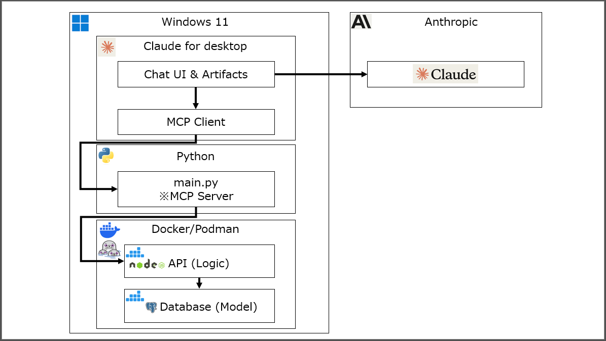

# MCP Driven UX 模板

<div align="center">

<p align="center">
  
</p>


<p align="center">
  <a href="./README.md"></a>
  <a href="./README_JA.md"></a>
  <a href="./README_CN.md"></a>
  <a href="./README_TW.md"></a>
  <a href="./README_KR.md"></a>
  <a href="./README_AR.md"></a>
</p>

**實現下一代用戶體驗「MCP Driven UX」的工單管理系統模板**

<a href="https://www.youtube.com/watch?v=Q7iKhyOF_OM" target="_blank" rel="noopener noreferrer">
  
</a>

*YouTube: Introduction: MCP Driven UX Template*

</div>

## 📋 概述

本專案是「MCP Driven UX」的參考實現，提出了從傳統的 MVC（Model-View-Controller）架構向與 LLM 的對話式界面的範式轉變。

利用 Model Context Protocol（MCP），本專案以工單管理系統為範例，展示了以下技術堆疊的角色分工和實現方法：

- **MCP Server (Python)**：LLM 與後端 API 的連接
- **業務邏輯 (TypeScript)**：RESTful API 實現
- **數據模型 (PostgreSQL)**：持久化層管理

## 🎯 概念

### 從 MVC 到 MCP Driven UX

目前的 Web 服務和客戶端-伺服器應用程式主要基於 MVC 模式。然而，隨著 LLM 的興起和像 MCP 這樣的標準化，從基於 UI 的服務向對話式（聊天/語音）界面的轉變是可以預期的。

本儲存庫以工單管理系統為例，實現了一個模板來實現這種轉變。

### 架構



```
┌─────────────┐     MCP      ┌───────────────┐     HTTP     ┌──────────────┐
│   Claude    │◄────────────►│  MCP Server   │◄────────────►│  API Server  │
│  Desktop    │              │   (Python)    │              │ (TypeScript) │
└─────────────┘              └───────────────┘              └──────┬───────┘
                                                                   │
                                                                   ▼
                                                             ┌──────────────┐
                                                             │  PostgreSQL  │
                                                             │     (DB)     │
                                                             └──────────────┘
```

## ✨ 主要功能

- **工單管理**
  - 工單的建立、更新、搜尋、詳細顯示
  - 歷史管理和評論功能
  - 狀態管理和負責人分配

- **MCP 整合**
  - 從 Claude Desktop 使用自然語言操作工單
  - 主數據的參考和篩選
  - 即時狀態確認

- **企業功能**
  - 基於角色的訪問控制
  - 審計軌跡和日誌管理
  - 多租戶支援

## 🛠️ 技術堆疊

### 後端
- **MCP Server**：Python 3.9+, MCP SDK
- **API Server**：Node.js, TypeScript, Express, PgTyped
- **Database**：PostgreSQL 16

### 基礎設施
- **Container**：Docker/Podman
- **Orchestration**：Docker Compose

## 📥 安裝方法

### 先決條件

- Docker 或 Podman（推薦）
- docker-compose 或 podman-compose
- Python 3.9 以上（用於 MCP 伺服器）
- Node.js 18 以上（用於 API 伺服器）
- Claude Desktop（MCP 客戶端）

### 設置步驟

1. **克隆儲存庫**

```bash
git clone https://github.com/Masa1984a/MCP_Driven_UX_Template.git
cd MCP_Driven_UX_Template
```

2. **認證設置**（Podman/Docker）

```bash
# 對於 Podman
podman login docker.io --username <username>

# 對於 Docker（使用 Podman compose 時也需要）
docker login docker.io --username <username>
```

3. **環境變數設置**

```bash
cp .env.sample .env
# 根據需要編輯 .env 檔案（如果要將數據改為日文，請更改為 INIT_LANG=ja）
```

4. **啟動容器**

```bash
# 對於 Podman
podman compose up -d

# 對於 Docker
docker-compose up -d
```

5. **Python虛擬環境設置**

為MCP伺服器設置Python環境：

```bash
cd ./mcp_server
python -m venv .venv
.venv\Scripts\Activate.ps1  # Windows PowerShell
# Bash/Linux/Mac: source .venv/bin/activate
python -m pip install --upgrade pip
pip install -r requirements.txt
```

6. **Claude for Desktop 的設置**

編輯 Claude for Desktop 的設定檔 `claude_desktop_config.json`：

```json
{
  "mcpServers": {
    "TicketManagementSystem": {
      "command": "uv",
      "args": [
        "--directory", "專案目錄路徑",
        "run",
        "mcp_server.py"
      ]
    }
  }
}
```

**注意**：請將 `專案目錄路徑` 替換為實際的專案路徑。在 Windows 的情況下，需要對路徑中的反斜線進行轉義。例如：`C:\\Users\\username\\projects\\ticket-system`

### 數據重置

刪除現有數據並重新初始化的情況：

```bash
# 包含卷的停止
podman compose down -v

# 重新啟動
podman compose up --build -d
```

## 🔍 使用方法

### 從 Claude Desktop 操作

MCP 伺服器啟動後，可以從 Claude Desktop 使用自然語言操作工單：

```
# 顯示工單列表
"顯示當前的工單列表"

# 使用特定條件搜尋
"本週預定完成的工單有哪些？"

# 建立工單
"建立新工單。用戶主檔更新的請求。"

# 更新工單
"將工單 TCK-0002 的狀態更改為處理中"
```

### API 端點

API 伺服器提供以下端點：

- `GET /tickets` - 獲取工單列表（支援篩選和分頁）
- `GET /tickets/:id` - 獲取工單詳細資訊
- `POST /tickets` - 建立新工單
- `PUT /tickets/:id` - 更新工單
- `POST /tickets/:id/history` - 新增歷史記錄
- `GET /tickets/:id/history` - 獲取歷史記錄

主數據：
- `GET /tickets/master/users` - 用戶列表
- `GET /tickets/master/accounts` - 帳戶列表
- `GET /tickets/master/categories` - 類別列表
- `GET /tickets/master/statuses` - 狀態列表

## 📊 數據模型

主要的表結構：

```sql
-- 工單表 (tickets)
- id: 工單ID (TCK-XXXX格式)
- reception_date_time: 受理日期時間
- requestor_id/name: 申請人
- account_id/name: 帳戶（公司）
- category_id/name: 類別
- status_id/name: 狀態
- person_in_charge_id/name: 負責人
- scheduled_completion_date: 預定完成日期
```

詳細結構請參閱 `/db/init/en/init.sql` 或 `/db/init/ja/init.sql`。

## 🚀 部署

### 生產環境部署

此應用程式可以部署到以下平台（需要驗證）：

- **Google Cloud Platform**
  - Cloud Functions v2（源碼上傳）
  - Cloud Run（Docker 映像）
  - Cloud SQL for PostgreSQL

- **AWS**
  - Lambda + API Gateway
  - ECS/Fargate
  - RDS for PostgreSQL

- **Azure**
  - Functions
  - Container Instances
  - Azure Database for PostgreSQL

關於AWS部署，請參閱我們的 [AWS 部署指南](aws-deploy/Guidebook_AWS.md)
關於Google Cloud Platform部署，請參閱我們的 [Google Cloud Platform 部署指南](gcp-deploy/Guidebook_gcp.md)
關於Azure部署，請參閱我們的 [Azure 部署指南](azure-deploy/Guidebook_Azure.md)

## ☁️ AWS 雲端環境

### 架構概述

MCP Driven UX 模板可以部署到 Amazon Web Services (AWS) 用於生產環境，提供可擴展的雲原生架構：

```
┌─────────────────┐    MCP(STDIO)    ┌─────────────────┐    HTTP/API    ┌──────────────────┐
│  Claude Desktop │◄────────────────►│   MCP Server    │◄──────────────►│   AWS App Runner │
│    (本機PC)      │                  │  (本機Python)    │                │    (API Server)  │
└─────────────────┘                  └─────────────────┘                └─────────┬────────┘
                                                                                   │
                                                                                   ▼
┌──────────────────────────────────────────────────────────────────────────────────┐
│                            AWS 雲端環境                                          │
│  ┌─────────────────┐  ┌─────────────────┐  ┌─────────────────┐                │
│  │ Secrets Manager │  │  Amazon ECR     │  │   Amazon RDS    │                │
│  │    (密鑰)       │  │ (Container Reg) │  │  (PostgreSQL)   │                │
│  └─────────────────┘  └─────────────────┘  └─────────────────┘                │
│                                                                                │
│  ┌─────────────────┐                                                           │
│  │   IAM Roles     │  ← 安全的服務間身份驗證                                     │
│  │    (安全性)      │                                                           │
│  └─────────────────┘                                                           │
└──────────────────────────────────────────────────────────────────────────────────┘
```

### 目前的 AWS 配置

模板設計為使用以下元件進行彈性部署：

#### 核心服務
- **Amazon App Runner**: 託管 Node.js/TypeScript API 伺服器，具有自動擴展功能
- **Amazon RDS for PostgreSQL**: 用於持久資料儲存的託管資料庫服務
- **Amazon ECR**: 應用程式映像的容器註冊表
- **AWS Secrets Manager**: API 金鑰和資料庫憑證的安全儲存
- **IAM Roles**: 無硬編碼密鑰的服務間身份驗證

#### 安全功能
- 所有敏感資料儲存在 AWS Secrets Manager 中
- 使用 IAM 角色進行安全服務身份驗證
- 基於 API 金鑰的外部存取身份驗證
- 透過 AWS VPC 和安全群組實現網路安全
- 所有通訊支援 HTTPS/SSL

#### 可擴展性和管理
- 基於環境變數的多環境部署配置
- 用於簡化部署的 PowerShell 自動化腳本
- 透過 CloudWatch 進行集中式日誌和監控
- 一致管理的資源命名慣例

### 部署指南

關於 AWS 環境的完整逐步部署說明，請參閱：
**[AWS 部署指南](aws-deploy/Guidebook_AWS.md)**

該指南涵蓋：
- 先決條件和環境設定
- 使用 AWS CLI 自動化資源配置
- 容器映像建置和部署到 ECR
- MCP Server 與 AWS API 的整合
- 安全配置和最佳實務
- 故障排除和維護

## ☁️ Google Cloud Platform 雲端環境

### 架構概述

MCP Driven UX 模板可以部署到 Google Cloud Platform (GCP) 用於生產環境，提供可擴展的雲原生架構：

```
┌─────────────────┐    MCP(STDIO)    ┌─────────────────┐    HTTP/API    ┌──────────────────┐
│  Claude Desktop │◄────────────────►│   MCP Server    │◄──────────────►│  Google Cloud    │
│    (本機PC)      │                  │  (本機Python)    │                │      Run         │
└─────────────────┘                  └─────────────────┘                └─────────┬────────┘
                                                                                   │
                                                                                   ▼
┌──────────────────────────────────────────────────────────────────────────────────┐
│                            GCP 雲端環境                                          │
│  ┌─────────────────┐  ┌─────────────────┐  ┌─────────────────┐                │
│  │ Secret Manager  │  │ Artifact Registry│  │   Cloud SQL     │                │
│  │    (密鑰)       │  │ (Container Reg) │  │  (PostgreSQL)   │                │
│  └─────────────────┘  └─────────────────┘  └─────────────────┘                │
│                                                                                │
│  ┌─────────────────┐                                                           │
│  │Service Accounts │  ← 安全的服務間身份驗證                                     │
│  │    (安全性)      │                                                           │
│  └─────────────────┘                                                           │
└──────────────────────────────────────────────────────────────────────────────────┘
```

### 目前的 GCP 配置

模板設計為使用以下元件進行彈性部署：

#### 核心服務
- **Google Cloud Run**: 託管 Node.js/TypeScript API 伺服器，具有自動擴展功能
- **Google Cloud SQL for PostgreSQL**: 用於持久資料儲存的託管資料庫服務
- **Google Artifact Registry**: 應用程式映像的容器註冊表
- **Google Secret Manager**: API 金鑰和資料庫憑證的安全儲存
- **Service Accounts**: 無硬編碼密鑰的服務間身份驗證

#### 安全功能
- 所有敏感資料儲存在 Google Secret Manager 中
- 使用 Service Accounts 進行安全服務身份驗證
- 基於 API 金鑰的外部存取身份驗證
- 透過 GCP VPC 和防火牆規則實現網路安全
- 所有通訊支援 HTTPS/SSL

#### 可擴展性和管理
- 基於環境變數的多環境部署配置
- 用於簡化部署的 gcloud CLI 自動化
- 透過 Cloud Logging 進行集中式日誌和監控
- 一致管理的資源命名慣例

### 部署指南

關於 GCP 環境的完整逐步部署說明，請參閱：
**[Google Cloud Platform 部署指南](gcp-deploy/Guidebook_gcp.md)**

該指南涵蓋：
- 先決條件和環境設定
- 使用 gcloud CLI 自動化資源配置
- 容器映像建置和部署到 Artifact Registry
- MCP Server 與 GCP API 的整合
- 安全配置和最佳實務
- 故障排除和維護

## ☁️ Azure 雲端環境

### 架構概述

MCP Driven UX 模板可以部署到 Microsoft Azure 用於生產環境，提供可擴展的雲原生架構：

```
┌─────────────────┐    MCP(STDIO)    ┌─────────────────┐    HTTP/API    ┌──────────────────┐
│  Claude Desktop │◄────────────────►│   MCP Server    │◄──────────────►│  Azure Container │
│    (本機PC)      │                  │  (本機Python)    │                │   Instances      │
└─────────────────┘                  └─────────────────┘                └─────────┬────────┘
                                                                                   │
                                                                                   ▼
┌──────────────────────────────────────────────────────────────────────────────────┐
│                            Azure 雲端環境                                        │
│  ┌─────────────────┐  ┌─────────────────┐  ┌─────────────────┐                │
│  │   Key Vault     │  │    Container    │  │   PostgreSQL    │                │
│  │    (密鑰)       │  │    Registry     │  │  Flexible Server│                │
│  └─────────────────┘  │     (ACR)       │  │    (資料庫)      │                │
│                       └─────────────────┘  └─────────────────┘                │
│                                                                                │
│  ┌─────────────────┐                                                           │
│  │ Managed Identity│  ← 安全的服務間身份驗證                                     │
│  │    (安全性)      │                                                           │
│  └─────────────────┘                                                           │
└──────────────────────────────────────────────────────────────────────────────────┘
```

### 目前的 Azure 配置

模板設計為使用以下元件進行彈性部署：

#### 核心服務
- **Azure Container Instances**: 託管 Node.js/TypeScript API 伺服器
- **Azure Database for PostgreSQL**: 用於持久資料儲存的 Flexible Server
- **Azure Container Registry (ACR)**: 容器映像的私人註冊表
- **Azure Key Vault**: API 金鑰和資料庫憑證的安全儲存
- **Managed Identity**: 無硬編碼密鑰的服務間身份驗證

#### 安全功能
- 所有敏感資料儲存在 Azure Key Vault 中
- 使用 Managed Identity 進行安全服務身份驗證
- 基於 API 金鑰的外部存取身份驗證
- 透過 Azure 內建防火牆規則實現網路安全
- 透過 Application Gateway 支援 HTTPS/SSL（選用）

#### 可擴展性和管理
- 基於環境變數的多環境部署配置
- 用於簡化部署的 PowerShell 自動化腳本
- 集中式日誌和監控功能
- 一致管理的資源命名慣例

### 部署指南

關於 Azure 環境的完整逐步部署說明，請參閱：
**[Azure 部署指南](azure-deploy/Guidebook_Azure.md)**

該指南涵蓋：
- 先決條件和環境設定
- 自動化資源配置
- 容器映像建置和部署
- MCP Server 與 Azure API 的整合
- 安全配置和最佳實務
- 故障排除和維護

## 🧩 可擴展性

此模板可以進行以下擴展：

- **額外的 MCP 工具**：檔案操作、外部 API 整合等
- **認證和授權**：OAuth 2.0、SAML 支援
- **通知功能**：電子郵件、Slack、Teams 整合
- **報告功能**：PDF 生成、儀表板
- **多語言支援**：i18n 實現

## 🤝 貢獻

歡迎提交拉取請求。對於重大更改，請先創建 Issue 進行討論。

1. Fork 儲存庫
2. 建立功能分支 (`git checkout -b feature/AmazingFeature`)
3. 提交更改 (`git commit -m 'Add some AmazingFeature'`)
4. 推送到分支 (`git push origin feature/AmazingFeature`)
5. 建立拉取請求

## 🔐 安全性

- 在生產環境中適當管理環境變數
- 絕不要提交數據庫憑證
- 適當設置 MCP 伺服器的訪問控制

## 📄 許可證

[MIT License](LICENSE)

## 🙏 致謝

- [Claude Code](https://docs.anthropic.com/en/docs/claude-code/overview) - Anthropic 的 SWE（軟體工程）Agent
- [Codex CLI](https://github.com/openai/codex) - OpenAI 的 SWE（軟體工程）Agent
- [Model Context Protocol](https://modelcontextprotocol.io) - Anthropic 的開放標準
- Claude Desktop - MCP 客戶端實現
- 所有貢獻者

## ⚠️ 商標和品牌聲明

雖然本儲存庫以 MIT 許可證作為 OSS 發布，但以下產品名稱、服務名稱和標誌是各公司的註冊商標或商標。本專案未獲得商標持有人的官方贊助、附屬或認可，並且與商標持有人之間沒有資本或合約關係。

| 商標 | 權利人 | 參考品牌指南 |
| ---- | ------ | ------------ |
| Claude™, Anthropic™ | Anthropic PBC | 請遵循品牌指南<sup>※1</sup> |
| OpenAI®, ChatGPT®, Codex® | OpenAI OpCo, LLC | OpenAI Brand Guidelines<sup>※2</sup> |
| GPT | OpenAI（申請中）等 | 即使作為通用術語使用，也建議避免誤識別 |
| PostgreSQL® | The PostgreSQL Global Development Group | — |
| Docker® | Docker, Inc. | — |

<sup>※1</sup> Anthropic 在其官方網站上定期更新商標政策。使用時請檢查最新指南。  
<sup>※2</sup> 使用 OpenAI 名稱/標誌時，需要遵循 OpenAI Brand Guidelines。指南可能會更改，因此建議定期審查。

### API/服務使用條款

- 整合生成式 AI 服務（如 **OpenAI API / Claude API**）時，請遵守各公司的[使用條款](https://openai.com/policies/row-terms-of-use)和 AUP。
- 對於商業用途或大量訪問，請務必審查有關速率限制、輸出的二次使用和個人資訊處理的條款。

> **免責聲明：**  
> 本專案按「現狀」分發，不提供任何形式的擔保。  
> 使用第三方服務風險自負，並受其各自條款的約束。

---

## 📝 變更歷史

- **2025-06-04**：新增對 Google Cloud Platform 和 AWS 雲端環境的支援
- **2025-06-03**：新增對 Azure 雲端環境的支援
- **2025-05-25**：將範例 SQL 資料從 10 條增加到 50 條工單，以便進行更真實的測試和演示
- **2025-05-23**：將 SQL 查詢遷移到 PgTyped 以實現類型安全的 SQL 查詢
- **2025-05-18**：初始版本發布，包含 MCP 整合、CRUD 操作和多語言支援

---

<div align="center">
用 ❤️ 為人機互動的未來而構建
</div>